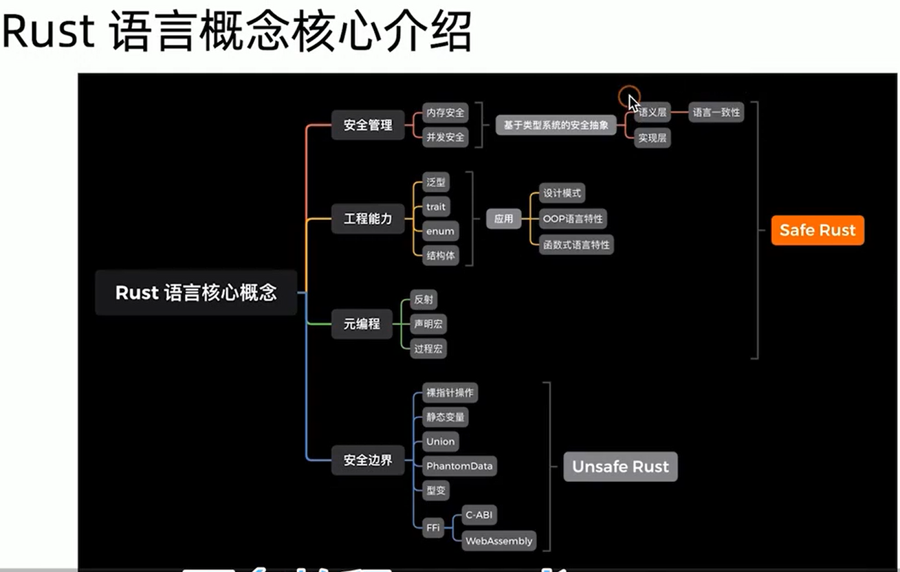

# rust程序编程之道 
https://read.douban.com/reader/ebook/128063673/
记录一下，我该书籍有收获的地方， 只能看100多页

##  Rust代码如何执行
Rust源码经过分词和解析，生成 AST（抽象语法树）。然后把AST进一步简化处理为HIR（High-level IR），目的是让编译器更方便地做类型检查。HIR会进一步被编译为MIR （Middle IR），这是一种中间表示，它在
最终，MIR会被翻译为LLVM IR，然后被LLVM的处理编译为能在各个平台上运行的目标机器码。

## 第二章语言精要
###  语句与表达式
Rust中的语法可以分成两大类：语句（Statement）和表达式（Expression）。语句是指要执行的一些操作和产生副作用的表达式。表达式主要用于计算求值。
语句又分为两种：声明语句（Declaration statement）和表达式语句（Expression statement）。
· 声明语句，用于声明各种语言项（Item），包括声明变量、静态变量、常量、结构体、函数等，以及通过extern和use关键字引入包和模块等。
· 表达式语句，特指以分号结尾的表达式。此类表达式求值结果将会被舍弃，并总是返回单元类型（）

Rust编译器在解析代码的时候，如果碰到分号，就会继续往后面执行；如果碰到语句，则执行语句；如果碰到表达式，则会对表达式求值，如果分号后面什么都没有，就会补上单元值（）。
当遇到函数的时候，会将函数体的花括号识别为块表达式（Block Expression）。块表达式是由一对花括号和一系列表达式组成的，它总是返回块中最后一个表达式的值

？？ 函数里面盼到表达式会直接返回吗

### 变量与绑定

Rust中的表达式一般可以分为位置表达式（Place Expression）和值表达式（Value Expression）。在其他语言中，一般叫作左值（LValue）和右值（RValue）
使用let关键字声明的位置表达式默认不可变，为不可变绑定
let 是绑定的意思 
这种连续用let定义同名变量的做法叫变量遮蔽


### 函数 
在Rust中，函数为一等公民。这意味着，函数自身就可以作为函数的参数和返回值使用。
Rust编译器也可以像C++或D语言那样，拥有编译时函数执行（Compile-Time Function Execution，CTFE）的能力  （c++ constexpr）
Rust中的CTFE是由miri来执行的。miri是一个MIR解释器，目前已经被集成到了Rust编译器 rustc中。Rust编译器目前可以支持的常量表达式有：字面量、元组、数组、字段结构体、枚举、只包含单行代码的块表达式、范围等


函数项类型是一个表达式， 它可以享受零大小类型的优势， 所以能不用函数指针就不用函数指针
https://zhuanlan.zhihu.com/p/54485063

### 闭包 
但是闭包和函数有一个重要的区别，那就是闭包可以捕获外部变量，而函数不可以
Rust中闭包实际上就是由一个匿名结构体和trait来组合实现的。(可调用对象 c++)
闭包有三个trait分别是 FnOnce，FnMut，  Fn 
函数相对闭包已经具备的trait : FnOnce，FnMut， Fn, copy, clone, send, aync
而闭包要根据对引用环境的具体情况，实现部分trait 

a. 没引用环境变量， 闭包实现了FnOnce
a. 引用不可变的环境变量， 闭包实现FnOnce, FnMut, Fn
a. 引用可变的环境变量， 闭包实现FnOnce，FnMut


### 字符类型
在Rust中，使用单引号来定义字符（Char）类型。字符类型代表的是一个Unicode标量值，每个字符占4个字节
Rust提供了原始的字符串类型str，也叫作字符串切片。它通常以不可变借用的形式存在，即&str。
出于内存安全的考虑，Rust将字符串分为两种类型，一种是固定长度字符串，不可随便更改其长度，就是str字符串；
另一种是可增长字符串，可以随意改变其长度，就是String字符串
本质上，字符串字面量也属于str类型，只不过它是静态生命周期字符串&＇static str。
str字符串类型由两部分组成：指向字符串序列的指针和记录长度的值。可以通过str模块提供的as_ptr和len方法分别求得指针和长度
Rust中的字符串本质上是一段有效的UTF8字节序列。所以，可以将一段字节序列转换为str字符串
str字符串类型由两部分组成：指向字符串序列的指针和记录长度的值

UTF-8字节序列  Vec<u8>

### 指针 
我们将可以表示内存地址的类型称为指针。Rust提供了多种类型的指针，包括引用（Reference）、原生指针（Raw Pointer）、函数指针（fn Pointer）和智能指针（Smart Pointer）。

引用，它本质上是一种非空指针

### 复合数据类型
Rust提供了4种复合数据类型，分别是：
·元组（Tuple）
    let tup : (i32, f64, u8) = (500, 6.4, 1);
·结构体（Struct）
    具名结构体（Named-Field Struct）
    元组结构体（Tuple-Like Struct） // 和元组有什么区别  结构体式被定义出来（匿名结构体）
    单元结构体（Unit-Like Struct）
·枚举体（Enum）
·联合体（Union）

除了具名结构体，Rust中还有一种结构体，它看起来像元组和具名结构体的混合体，叫元组结构体，。其特点是，字段没有名称，只有类型
当一个元组结构体只有一个字段的时候，我们称之为New Type模式，
    eg. struct Integer(u32);
        定义了Integer单字段结构体，字段为u32类型。之所以称为New Type模式，是因为相当于把u32类型包装成了新的Integer类型


## 其他

1. 模式匹配 
模式匹配是一种结构性解构 

2. 值语义  和 指针语义（行为像指针）
3. 一个rs文件就代表着一个模块 
4. rust语言的组成部分
    类型系统（核心 TODO）， 安全抽象， 范式编程， 资源管理 
5. rust语言的核心概念


6. 所有权 
仿射类型 ： 资源最多只能被使用一次 
复制语义（copy）
移动语义（move）
所有权共享（clone）: 有些地方是复制， 有些变量是引用计数RC/ARC增加


7. rust宏不是传统字符串替换，它是语法树到语法树的
8.  rust 认为组合大于继承， 有没继承这个功能 （面向对象功能薄弱一点）
9.  使用消息传递在线程间传送数据  （rust并发模型基于消息传递，）
这个思想来源于 Go 编程语言文档中 的口号：“不要通过共享内存来通讯；而是通过通讯来共享内存。”
10. 据说rust入门难， 但是之后开发效率不会比go差太多 
11. rust主要的优势是解决内存安全和并行安全的问题
12. rust适合计算密集型的应用

# rust死灵书
## 学习资料
书籍
http://rust.e.lntu.edu.cn/nomicon/intro.html
或者 
https://learnku.com/docs/nomicon/2018


视频教程
https://www.bilibili.com/video/BV1xp4y1a78D?p=1&vd_source=8ea6dc6c02215b66383cf6ab9791e3b4
确认现在看视频效率有点低了， 准备开始自己看书， 不懂查资料

## rust中的数据布局
### repr(Rust)
1. 基础类型通常按照其大小对齐，尽管这是特定平台的行为。例如，在 x86 上u64和f64通常被对齐到 4 字节（32 位）。
   都是32位我是没想到的， 内存对齐， 64位指针字节大小还是64位的
2. 注意，在动态大小的类型的情况下，一个类型的大小和对齐方式可能不是静态的。
3. 默认情况下，复合结构的对齐方式等于其字段对齐方式的最大值
4. 然而，除了数组（密集排列且有序）之外，数据的布局在默认情况下都不是确定的
Rust 确实保证两个实例的数据布局完全相同。然而，Rust 目前并不保证 A 的实例与 B 的实例具有相同的字段排序或填充

### 非正常大小的类型
1. Rust 支持动态大小的类型（DST）：这些类型没有静态（编译时）已知的大小或者布局
   任何指向 DST 的指针都会变成一个包含了完善 DST 类型信息的胖指针
   Rust 暴露了两种主要的 DST 类型：
        trait objects：dyn MyTrait
        slices：[T]、str及其他  // ptr + 元素数量

2. 零大小类型 (ZSTs)
    struct Nothing; // 无字段意味着没有大小
    // 所有字段都无大小意味着整个结构体无大小
在 Rust 中，任何产生或存储 ZST 的操作都可以被简化为无操作（no-op）
安全的代码不需要担心 ZST，但是不安全的代码必须小心没有大小的类型的后果。特别是，指针偏移是无操作的

3. 空类型
enum Void {} // 没有变体的类型 = 空类型
你可以使用 *const Void 模拟 C 语言的 void * 类型，但是使用 *const () 却不会得到任何东西，因为这个函数对于随机解引用是安全的。


```
let array: [u8; 10] = [1; 10]
let s = &array[..]; // 切片
mem::sizeof(s) // 10
mem::sizeof(&s) // 16 
```


### 其他repr


## 所有权
有两种类型的引用：

共享的引用：&
可变引用：&mut  (也叫借用 ?? 感觉不对)
```
let mut s1 = String::from("hello");
let r1 = &s1;
let r2 = &s1;
println!("{}, {}", r1, r2);
println!("{}, {}", *r1, *r2); // *r1 等价于 r1 , 隐式调用
```


## 生命周期 
然而，一旦你跨越了函数的边界，你就需要开始考虑生命周期了。生命周期是用撇号表示的：'a、'static


# Rust for Rustaceans

https://www.bilibili.com/video/BV1TF411P74m/?spm_id_from=333.999.0.0&vd_source=8ea6dc6c02215b66383cf6ab9791e3b4

https://www.bilibili.com/video/BV1Pu4y1Z7dT/?spm_id_from=333.999.0.0&vd_source=8ea6dc6c02215b66383cf6ab9791e3b4


# Asynchronous Programming in Rust  异步编程
 https://rust-lang.github.io/async-book


# Rust API Guidelines   接口设计
 https://rust-lang.github.io/api-guidelines/


# Rust编程知识拾遗系列
https://www.bilibili.com/video/BV1XK411L7hM/?spm_id_from=333.999.0.0&vd_source=8ea6dc6c02215b66383cf6ab9791e3b4


